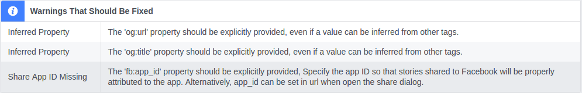
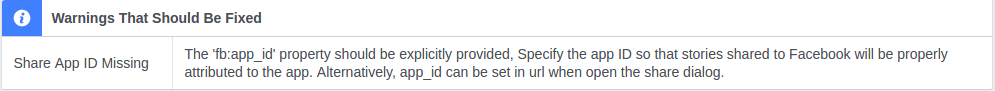
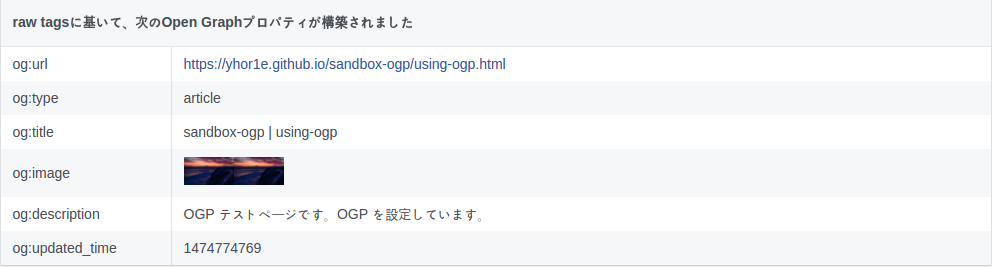
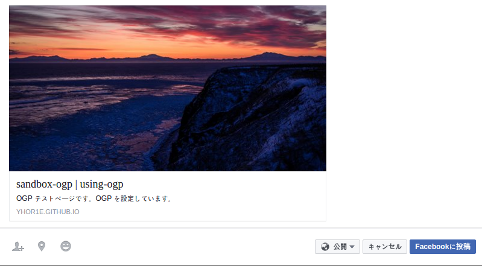

# sandbox-ogp

OGP について、試すリポジトリ。

作成したウェブページは、https://yhor1e.github.io/sandbox-ogp/ で公開。

OGP については、次を参照。

http://ogp.me/

## refs

参考にした情報

### ウェブ管理者 - シェア機能 - ドキュメンテーション - 開発者向けFacebook

https://developers.facebook.com/docs/sharing/webmasters#markup

### デバッガー - 開発者向けFacebook

https://developers.facebook.com/tools/debug/

### SEO嫌いにお送りするSEO策。これでもうSEOについてしばらく考えなくて良いぜ！！

http://qiita.com/taiyop/items/050c6749fb693dae8f82

## note

1. using-opg.html に対して、デバッガーを使用した結果

2. `ogp:title`、`ogp:url` をそれぞれ改善して、再度、デバッガーを使用した結果

3. og のそれぞれのプロパティも意図した通り認識されている。

4. Facebook でのシェアプレビュー。綺麗に表示されている模様。

## resouce

次の画像を使用。

https://photo.kankouyohou.com/photo/1/?img=0  
【北海道 能取岬】、経済産業省、クリエイティブ・コモンズ・ライセンス 表示4.0 国際
